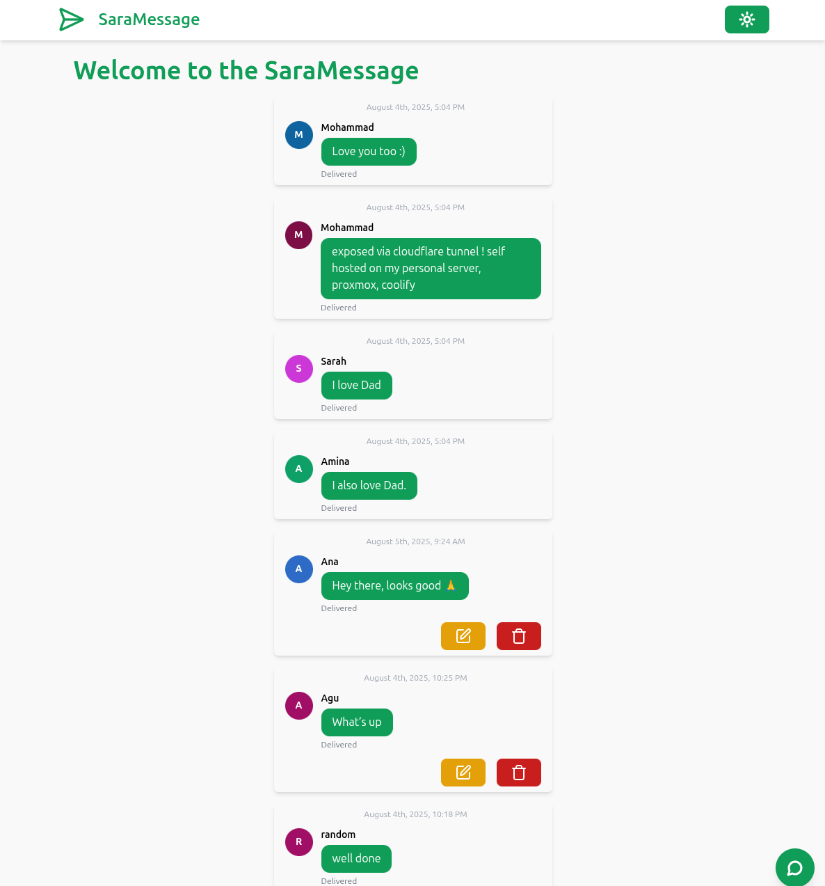

# SaraMessage

SaraMessage is a simple, full-stack messaging app built with **React**, **Express**, and **PostgreSQL**. Users can submit, edit, and delete short messages, which are persisted in the backend and displayed in real-time on the frontend.

> 🟢 **Live Demo**: [https://link.sarawebs.com/saramsg](https://link.sarawebs.com/saramsg)

## Features

- 📝 Add a new message
- ✏️ Edit existing messages (if editable)
- ❌ Delete messages
- 📦 PostgreSQL-backed data storage
- 🔄 Real-time list updates via fetch API

## Tech Stack

- **Frontend**: React + Vite + Tailwind CSS
- **Backend**: Node.js + Express
- **Database**: PostgreSQL
- **Deployment**: Dockerized and self-hosted

## Getting Started

### 1. Clone the Repository

```bash
git clone https://github.com/mdahamshi/top-basic-msg-full.git
cd top-basic-msg-full
````

### 2. Set Up Environment Variables

Create a `.env` file in the backend directory with the following:

```env
PORT=3000
POSTGRES_DB=saramsg
SERVICE_USER_POSTGRES=userapp
SERVICE_PASSWORD_POSTGRES=secret
```
### 2.5. Set Up docker-compose.override.yml

Create a `docker-compose.override.yml` for local development:

```env
services:
  server:
    ports:
      - '3000:3000'
  client:
    ports:
      - '8080:80'

```

### 3. Run with Docker

```bash
docker-compose up --build
```

The app will be available at `http://localhost:8080`.


## API Endpoints

* `GET /api/messages` — Get all messages
* `GET /api/messages/:id` — Get a message
* `POST /api/messages` — Create a new message
* `PUT /api/messages/:id` — Update a message
* `DELETE /api/messages/:id` — Delete a message

## Screenshots



## License

This project is open-source and available under the [MIT License](LICENSE).

